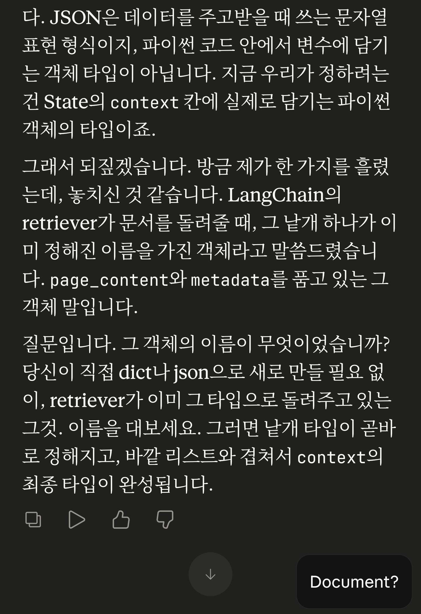
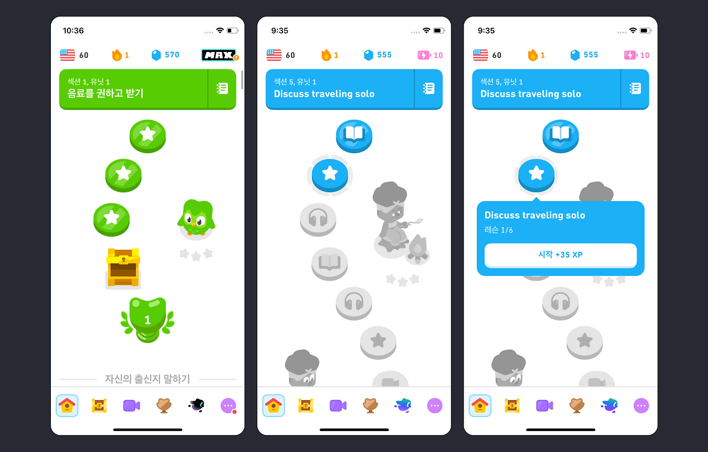
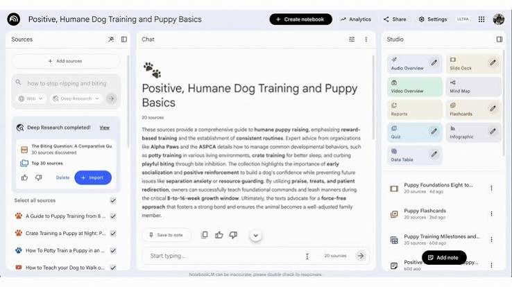
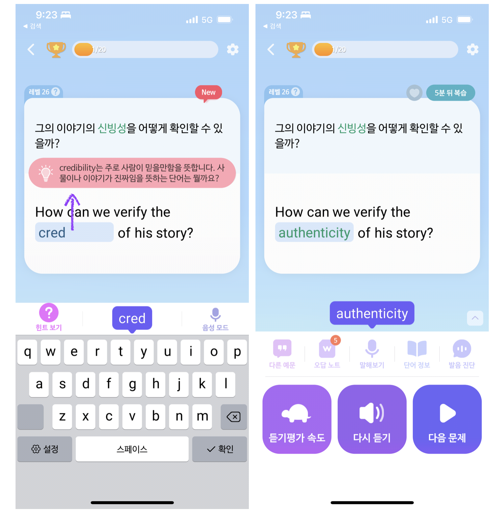
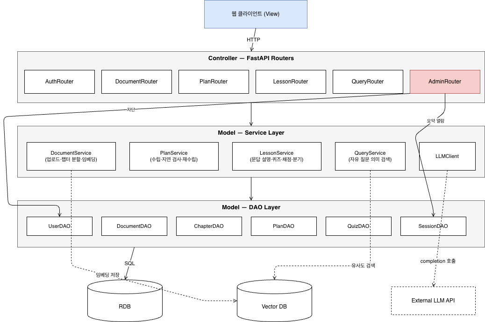
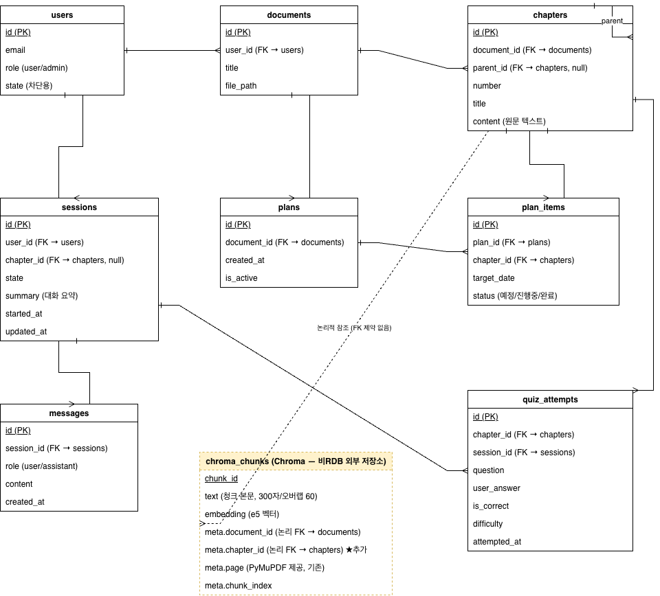
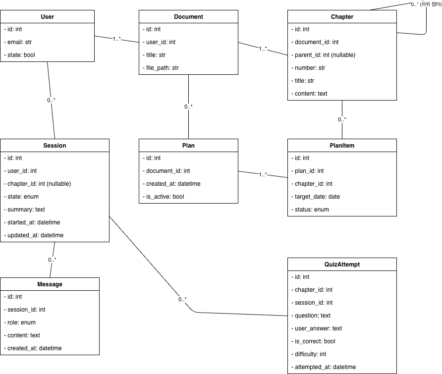

# 학습 보조 AI 에이전트 — 소프트웨어 설계서

---

## 1. 시스템 개요

- 시스템 개요
    - 개발 배경 및 목적 : 항상 ai를 이용하면서 내가 이 지식을 제대로 습득하고 있는것인가 하는 걱정이 들었다. 실제로 그런 걱정을 하는 사람이 많았던것인지 관련 연구 결과도 나오고 있고 ai가 짜준 코드를 제대로 이해하기 위해 ai용 스킬을 만들고 공유하는것에 사람들이 많은 관심을 주고 있기도 하다. 구글에서도 이러한 수요를 파악하고 있는것인지 노트북lm을 출시하고 최근에는 쇼츠 기능을 출시하는 등 ai를 활용한 학습에 관심을 갖고 있는 사람들이 많다. 하지만 notebook lm과 같은 많은 학습용으로 공유되는 기술들은 어느정도 알고 있는 사람들을 대상으로 하거나 문제의 퀄리티가 아쉽거나 특정 기술에 특화 되어있어 그저 학습을 도울 수 있다에 그치는 수준이었지 정말로 개념을 익히고 이를 검증하는 과정을 거쳐 개념을 확립시켜주는 학습 전용 ai를 찾아보기는 어려웠다. 기술에 대한 습득보다는 개념 위주의 학습을 시켜주는 학습 전문 ai를 만들고자 하였다. 
    - 특징 및 장점
        - 사용자가 올리는 문서를 기반으로 하여 내용을 설명하여 준다
        - 사용자가 올린 문서를 분석하여 챕터별로 쪼갠 뒤 그에 대한 계획을 세워 사용자에 대한 수업을 진행한다
        - 사용자와의 상호작용을 통하여 계획은 유연하게 변경 가능하다
        - 사용자에 대한 개념 설명 이후 사용자는 퀴즈를 통해 학습 여부를 확인 가능하다
        - llm은 소크라테스의 학습 방식(문답을 통하여 정답을 이끌어내기)을 차용하여 학습자가 주체적으로 사유하도록 한다
    - 관련 사례 분석 : Notebook LM, 말해보카, 듀오링고
     

- 개발 프로그램: 웹 (FastAPI 기반 백엔드로 배포 예정, 프론트엔드는 미정)
- 알림 방식: 푸시/메일 없음. 사용자 접속 시점 기준으로 지연 등을 안내
- 핵심 설계 원칙: **트리거는 코드, 내용 생성은 LLM.**
  단, "설명 완료 여부 판단"은 자연어 흐름 판단이므로 유일하게 LLM이 트리거를 겸한다.


---

## 2. 요구사항명세서
[구글 스프레드시트 링크](https://docs.google.com/spreadsheets/d/1lVzLVJ5RE_eNoh3Z4Ft2djWiOvUAQN9X9fVOEmemcaI/edit?usp=sharing)

## 3. 유스케이스 모델
### 3.1 액터
- **학습자(User)** : 인간 액터. 문서 업로드, 수업, 퀴즈, 질문, 계획 관리를 수행.
- **관리자** : 프롬프트를 이용한 부정 시도 및 부적절한 대화 내용 발생 시 유저 차단 등 회원 관리

### 3.2 유스케이스 목록

| ID | 유스케이스 | 관련 FR |
|----|-----------|---------|
| UC-01 | 문서 업로드 | FR-01, FR-02 |
| UC-02 | 학습 계획 수립 요청 | FR-03 |
| UC-03 | 수업 진행 (설명 → 이해 확인) | FR-05 ~ FR-11 |
| UC-04 | 자유 질문 | FR-12 |
| UC-05 | 학습 재개 | FR-13, FR-04 |
| UC-06 | 계획 재수립 | FR-14, FR-04, FR-09 |

### 3.3 주요 유스케이스 기술 (Use Case Description)

#### UC-01 문서 업로드
- 액터: 학습자
- 사전조건: 로그인 상태
- 기본 흐름:
  1. 학습자가 PDF를 업로드한다.
  2. 시스템이 문서를 저장하고 챕터/세부 챕터로 분할한다.
  3. 시스템이 각 세부 챕터의 임베딩을 생성·저장한다.
  4. 시스템이 챕터 목차를 학습자에게 제시한다.
- 대안 흐름:
  - 2a. 분할된 세부 챕터가 크기 상한을 초과하면 추가 분할한다. (NFR-01)

#### UC-03 수업 진행
- 액터: 학습자
- 사전조건: 문서가 분할 완료된 상태
- 기본 흐름:
  1. 학습자가 특정 세부 챕터의 수업 시작을 요청한다.
  2. 시스템이 해당 챕터 원문을 근거로 문답식 설명을 진행한다.
  3. 시스템이 설명 완료를 판단하면 이해 확인 퀴즈를 출제한다.
  4. 학습자가 답변하고, 시스템이 채점·기록한다.
  5. 정답이면 챕터를 완료 처리하고 다음 챕터를 안내한다.
- 대안 흐름:
  - 4a. 오답(세션 내 누적 5회 미만): 해당 개념을 재설명 후 3으로 복귀.
  - 4b. 오답 누적 5회 이상: 설명 수준·퀴즈 난이도를 하향하고 계획 재수립을 제안 (UC-06 확장 관계).

#### UC-05 학습 재개
- 기본 흐름:
  1. 학습자가 접속한다.
  2. 시스템이 계획 지연 여부를 검사한다.
  3. 지연이 있으면 알림과 함께 계획 재수립을 제안한다 (UC-06 확장 관계).
  4. 시스템이 마지막 진행 지점을 복원하여 사용자의 의사에 따라 원래 계획대로 진행하거나 계획을 재수립한다.
     - 지연이 없을 시 계획대로 수업을 진행

#### UC-04 자유 질문
- 기본 흐름:
  1. 학습자가 문서에 대해 자유 형식 질문을 입력한다.
  2. 시스템이 질문을 임베딩하여 의미 유사도 검색으로 관련 챕터를 조회한다.
  3. 시스템이 해당 원문을 근거로 답변을 생성한다.
- 대안 흐름:
  - 2a. 유사도가 기준 이하인 챕터만 존재하면, 문서에서 근거를 찾지 못했음을 알린다.
  - 2b. 웹검색을 진행하여 부족한 근거를 채워 대답한다.

### 3.4 유스케이스 다이어그램
.jpg)
```
[학습자] ─── UC-01 문서 업로드
        ─── UC-02 학습 계획 수립 요청
        ─── UC-03 수업 진행 ◄──(extend)── UC-06 계획 재수립   ※ 오답 5회 누적 시에만
        ─── UC-04 자유 질문
        ─── UC-05 학습 재개 ◄──(extend)── UC-06 계획 재수립   ※ 지연 감지 시에만
        
[관리자] - 로그 열람
       - 사용자 차단
```

---

## 4. ERD

### 4.1 엔터티 정의

**users** — 사용자 계정 (NFR-02 근거)

| 컬럼 | 타입 | 비고 |
|------|------|------|
| id | PK | |
| email | varchar | unique |


**documents** — 업로드 문서 (FR-01)

| 컬럼 | 타입 | 비고 |
|------|------|------|
| id | PK | |
| user_id | FK → users.id | |
| title | varchar | |
| file_path | varchar | 원본 파일 저장 위치 |

**chapters** — 분할된 챕터/세부 챕터 (FR-02, FR-05, FR-12)

| 컬럼 | 타입 | 비고 |
|------|------|------|
| id | PK | |
| document_id | FK → documents.id | |
| parent_id | FK → chapters.id, nullable | 세부 챕터의 상위. 최상위는 NULL (자기참조) |
| number | varchar | 예: "1", "1-1" |
| title | varchar | |
| content | text | **원문 텍스트** (NFR-04). 크기 상한 적용 (NFR-01) |

**plans** — 학습 계획 헤더 (FR-03, FR-14)

| 컬럼 | 타입 | 비고 |
|------|------|------|
| id | PK | |
| document_id | FK → documents.id | |
| created_at | timestamp | |
| is_active | boolean | 재수립 시 기존 계획 false 처리 → 이력 보존 |

**plan_items** — 계획 상세 (FR-04 지연 검사의 대상)

| 컬럼 | 타입 | 비고 |
|------|------|------|
| id | PK | |
| plan_id | FK → plans.id | |
| chapter_id | FK → chapters.id | |
| target_date | date | |
| status | enum | 예정 / 진행중 / 완료 |

**quiz_attempts** — 퀴즈 시도 이력 (FR-07, FR-09, FR-11)

| 컬럼 | 타입 | 비고 |
|------|------|------|
| id | PK | |
| chapter_id | FK → chapters.id | |
| session_id | FK → sessions.id | 세션 내 오답 5회 집계의 범위 |
| question | text | |
| user_answer | text | |
| is_correct | boolean | |
| difficulty | int | 난이도 조정 이력 추적 (FR-11) |
| attempted_at | timestamp | |

**sessions** — 학습 세션 (FR-13 복원)

| 컬럼 | 타입 | 비고 |
|------|------|------|
| id | PK | |
| user_id | FK → users.id | |
| chapter_id | FK → chapters.id, nullable | 진행 중이던 챕터 |
| state | enum | 설명중 / 퀴즈중 / 완료 등 |
| summary | text | 대화 맥락 요약. **세션 복원(FR-13) 시 이 요약을 컨텍스트로 사용** (사용자 확정: 요약 저장) |
| started_at / updated_at | timestamp | |

**messages** — 진행 중 세션의 문답 기록 (FR-05 문답 맥락 유지용)

| 컬럼 | 타입 | 비고 |
|------|------|------|
| id | PK | |
| session_id | FK → sessions.id | |
| role | enum | user / assistant |
| content | text | |
| created_at | timestamp | |

### 4.3 외부 벡터 저장소 스키마 (Chroma — 코드 대조 후 v0.4 추가)

**chroma_chunks** (컬렉션)

| 필드 | 비고 |
|------|------|
| chunk_id | Chroma 내부 id |
| text | 청크 본문. 현재 코드 기준 300자 / 오버랩 60 (RecursiveCharacterTextSplitter) |
| embedding | intfloat/multilingual-e5-base, 정규화 |
| meta.document_id | 논리 FK → documents (추가 필요) |
| meta.chapter_id | 논리 FK → chapters |
| meta.page | PyMuPDF 로더가 이미 제공|
| meta.chunk_index | 챕터 내 청크 순서 |

**파이프라인 순서 재구성 (중요)**: 현재 코드는 PDF → 페이지 → 청크로 직행하며 챕터
개념이 없다. 결정 (a)가 성립하려면 순서가 다음과 같이 바뀌어야 한다.

```
PDF 업로드 → 챕터 분할(LLM) → chapters 저장(RDB)
          → 챕터별 content를 청킹 → chapter_id 메타데이터와 함께 Chroma 저장
```

즉 청킹의 입력이 "페이지"에서 "챕터 content"로 바뀐다. 청크 크기(300/60) 등 스플리터
설정 자체는 유지 가능하다.


### 관계 요약

```
users 1 ──── N documents
documents 1 ──── N chapters
chapters 1 ──── N chapters  
documents 1 ──── N plans
plans 1 ──── N plan_items
chapters 1 ──── N plan_items
chapters 1 ──── N quiz_attempts
sessions 1 ──── N quiz_attempts
users 1 ──── N sessions
sessions 1 ──── N messages
chapters 1 ---- N chroma_chunks  
```
