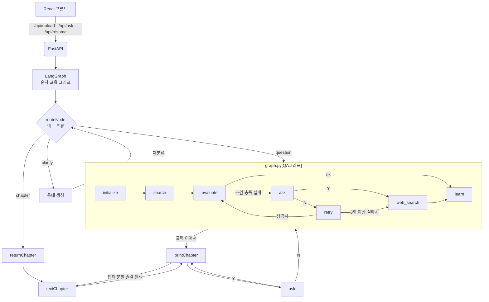
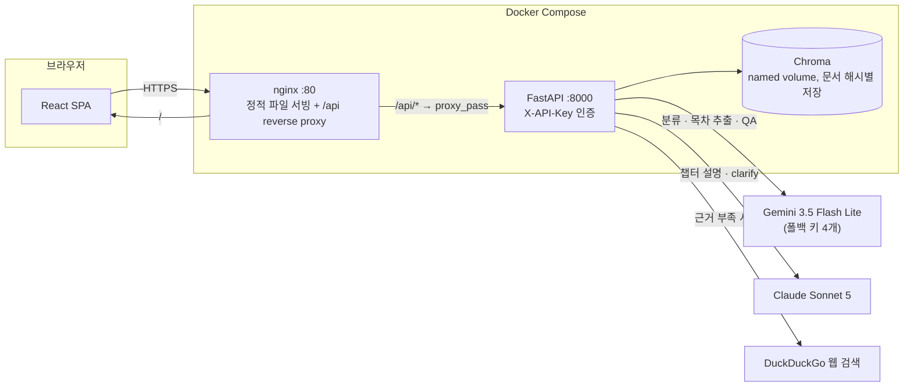
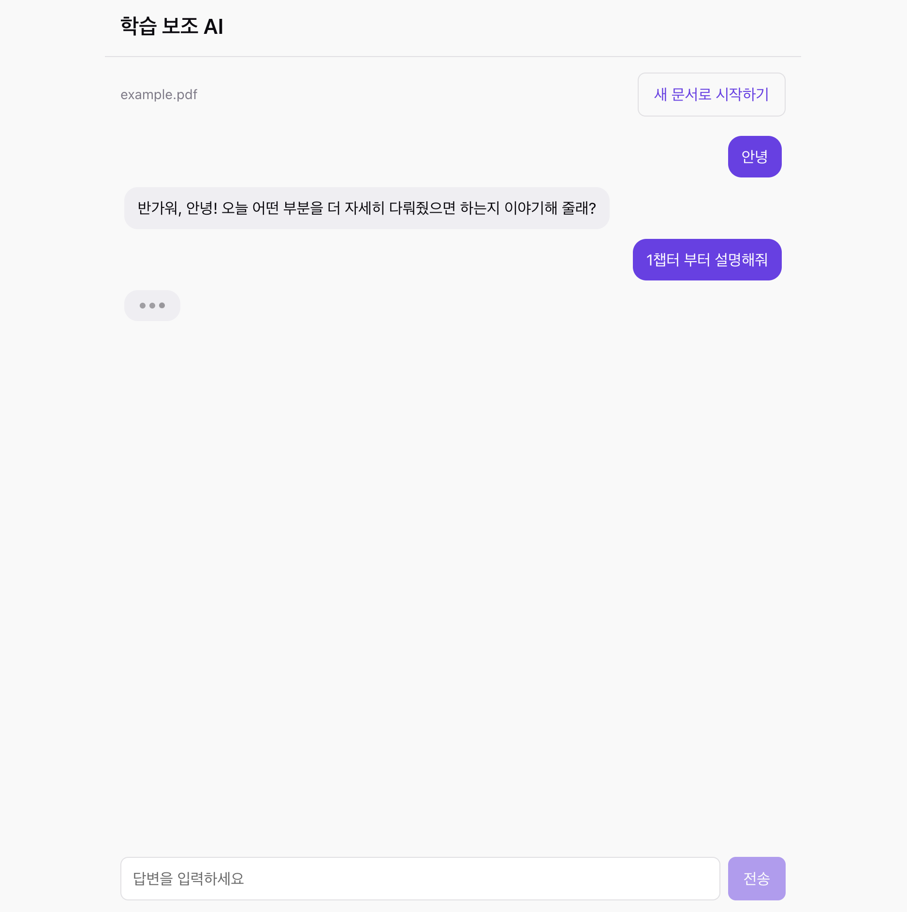
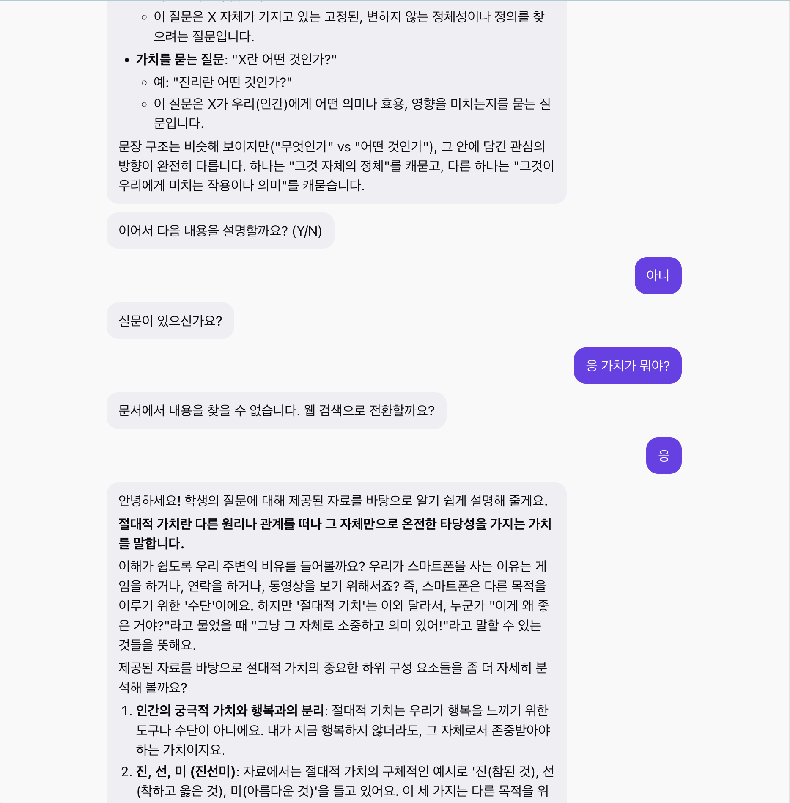

# Docent AI


> **요약해주는 AI는 한 번에 다 설명해버린다.**
> Docent AI는 **한 소개념씩 끊어서, 계속할지 사용자에게 먼저 묻는다.**

```
🧑 (PDF 업로드) "1장부터 설명해줘"

🤖 머신러닝은 명시적으로 프로그래밍하지 않아도
   데이터로부터 패턴을 학습하는 방법입니다. ...
   (한 소개념 분량만)

   이어서 다음 내용을 설명할까요? (Y/N)

🧑 N

🤖 질문이 있으신가요?

🧑 지도학습이랑 뭐가 달라?

🤖 (문서 근거로 답변) ...
   더 궁금한게 있나요? (Y/N)
```

문서에서 답을 못 찾으면 지어내지 않고, **웹 검색으로 넘어갈지 사용자에게 먼저 확인**한다.

---

## Problem

AI에게 요약을 맡기고 나면, 정리는 됐는데 정작 내가 이 지식을 제대로 습득한 건지는 확신이 서지 않을 때가 많다.

NotebookLM 같은 도구들은 이미 어느 정도 아는 사람에게는 훌륭하지만, 처음 배우는 사람에게는 한 번에 너무 많은 내용을 쏟아낸다. 사용자는 그걸 읽기만 할 뿐, 이해했는지 확인할 지점이 없다.

Docent AI는 문서를 통째로 요약하는 대신, 강사가 한 강의를 진행하듯 **한 소개념씩만** 설명하고 그때마다 "이어서 설명할까요?"를 묻는다. 진행 여부와 속도는 항상 사용자가 정한다. 설명 도중에도 질문으로 전환할 수 있고, 문서에 근거가 없으면 그 사실을 그대로 말한 뒤 웹 검색으로 넘어갈지도 사용자에게 확인받는다.


---

## Design Principles

| 원칙 | 시스템에서 어떻게 구현했는가 |
|------|---------------------------|
| 설명은 한 번에 하나의 소개념만 | `lecture_prompt`가 `---` 구분자로 소개념 단위를 강제 분리하고, `printChapter`가 `cursor`로 한 번에 한 단위만 노출한다 |
| 진행 여부는 사용자가 정한다 | 단위마다 `ask()`가 Y/N `interrupt`를 던지고, `after_ask`(코드)가 그 응답으로 다음 청크·다음 챕터·종료를 결정한다. LLM은 여기서 아무것도 결정하지 않는다 |
| 애매한 입력은 넘겨짚지 않고 되묻는다 | `classify_unclear`가 chapter/question/clarify 중 하나로도 판정하지 못하면 `clarify` 노드가 되묻는 질문만 생성하고, 답이 오면 다시 분류로 돌아간다 |
| 문서에 없으면 모른다고 말한다 | QA 서브그래프의 `evaluate`가 유사도 평균이 임계값 미만이면 질문을 재작성해 최대 2회 재검색하고, 그래도 부족하면 웹 검색 전환 여부를 사용자에게 직접 묻는다(임의로 전환하지 않는다) |

---

## Learning Loop

사용자의 한 마디가 그래프 안에서 여러 상태를 오가며 처리된다.

- 챕터 요청이면 목차에서 위치를 찾아 설명을 시작하고,
- 설명 도중 "아니오"라고 답하면 질문 모드로 전환되고,
- 질문에 대한 근거가 부족하면 재검색 후 웹 검색 여부를 물으며,
- 입력이 애매하면 되물어 확인한 뒤 다시 분류한다.

Docent AI는 이 흐름을 **LangGraph 기반 상태 머신**으로 관리하며, 매 인터럽트마다 진행을 멈추고 `thread_id`로 나중에 재개할 수 있다.



---

## Architecture

프론트(정적 파일)와 백엔드(LLM 호출)를 별도 컨테이너로 분리하고, nginx가 `/api/*`만 백엔드로 넘긴다.



### 기술 스택

| 구분 | 사용 기술 |
|------|-----------|
| 오케스트레이션 | LangGraph (`StateGraph`, `interrupt`, `MemorySaver`) |
| LLM | Gemini 3.5 Flash Lite (분류·목차 추출·QA), Claude Sonnet 5 (챕터 설명·clarify) |
| 임베딩 | `intfloat/multilingual-e5-base` (HuggingFace, 로컬 추론) |
| 벡터 스토어 | Chroma (문서 MD5 해시별 디렉터리로 재업로드 시 재사용) |
| 웹 검색 | ddgs (DuckDuckGo) |
| 인증 | 커스텀 `X-API-Key` 헤더 (`APIRouter(dependencies=[Depends(verify_key)])`) |
| 백엔드 / 프론트 | FastAPI / React (Vite) |
| 배포 | Docker Compose (backend + frontend 분리) + nginx + AWS EC2 |
| 관측 | LangSmith |

---

## Engineering Decisions

| 영역 | 선택 | 채택 이유 |
|------|------|-----------|
| 에이전트 | LangGraph `StateGraph` + `interrupt()` + `MemorySaver` | 챕터 진행은 사용자 응답을 기다렸다 재개해야 하는 멀티턴 상태 머신이라, `interrupt`/`Command(resume=...)` 기반 재개가 콜백이나 반복문보다 자연스럽다 |
| LLM 이원화 | 분류·목차 추출·QA: Gemini 3.5 Flash Lite / 챕터 설명·clarify: Claude Sonnet 5 | 구조화 출력과 짧은 판정은 비용이 싼 Gemini로, 학생이 실제로 읽는 긴 설명은 품질이 더 중요해 Claude로 분리했다 |
| LLM 폴백 | Gemini API 키 4개를 `with_fallbacks`로 체인 | 무료 티어 일일 호출 한도에 걸려도 다음 키로 자동 전환되게 했다 |
| 검색 실패 대응 | Corrective RAG — 유사도 평균이 임계값 미만이면 질문을 재작성해 최대 2회 재검색, 그래도 부족하면 사용자에게 웹 검색 전환 여부를 직접 확인 | 문서에 없는 내용을 지어내는 대신, 재시도 후에도 안 되면 사람이 판단하게 한다 |
| 인증 | 커스텀 `X-API-Key` 헤더 + FastAPI 라우터 단위 `Depends` | 개인 프로젝트 데모용 최소 인증 — OAuth 같은 체계 대신 라우터 하나에 의존성을 걸어 `/api/*` 전체를 한 번에 보호한다 |
| 프론트 상태 관리 | React `useState` + 모듈 스코프 변수 (`client.js`의 `apiKey`) | 세션 하나짜리 앱이라 Redux/Context 없이도 충분하다. 여러 컴포넌트가 필요로 하는 API 키만 모듈 변수로 공유한다 |
| 배포 | Docker Compose(backend + frontend 분리) + nginx reverse proxy + EC2 | 정적 파일과 LLM 호출 서버를 독립적으로 재시작·교체할 수 있게 분리했다 |
| 패키지 관리 | uv (`pyproject.toml` + `uv.lock`), Docker 빌드도 동일 lock 파일 사용 | 로컬 개발과 컨테이너 빌드의 의존성 버전을 동일하게 고정한다 |

---

## API Reference

REST API로 제공되며, 세 엔드포인트 모두 `POST`이고 `/api` 하위에 있다 (`GET /api/verify` 제외). 모든 `/api/*` 요청은 `X-API-Key` 헤더가 필요하다. 대화는 `/api/ask`로 시작해 `thread_id`를 발급받고, 응답이 `interrupted`이면 사용자 입력을 받아 같은 `thread_id`로 `/api/resume`을 반복한다.

### `GET /api/verify`
API 키가 유효한지 확인한다. 200이면 통과, 401이면 실패.

### `POST /api/upload`
PDF를 업로드하고 색인(벡터 스토어)을 생성한다. `multipart/form-data`로 전송한다.

| Parameter | Type | Required | Description |
|-----------|------|----------|-------------|
| `file` | file | ✓ | 업로드할 PDF |

**Returns**
```json
{ "filename": "lecture.pdf" }
```

### `POST /api/ask`
첫 입력을 보내 대화를 시작한다.

| Parameter | Type | Required | Description |
|-----------|------|----------|-------------|
| `question` | string | ✓ | 사용자 입력 (챕터 요청 또는 질문) |
| `thread_id` | string \| null | | 이어가기용 식별자. 첫 요청은 `null`이면 새로 발급 |

**Returns:** 공통 응답 객체 (아래 참고)

### `POST /api/resume`
중단된 지점을 이어간다. `/api/ask`에서 받은 `thread_id`를 그대로 사용해야 대화 맥락이 유지된다.

| Parameter | Type | Required | Description |
|-----------|------|----------|-------------|
| `thread_id` | string | ✓ | `/api/ask`에서 발급받은 대화 식별자 |
| `reply` | string | ✓ | 직전 `stage`에 대한 사용자 응답 (Y/N 또는 자유 입력) |

**Returns:** 공통 응답 객체 (아래 참고)

### 공통 응답 객체

```json
{
  "status": "interrupted",
  "thread_id": "생성된-uuid",
  "stage": "yn",
  "msg": "이어서 다음 내용을 설명할까요? (Y/N)",
  "answer": "챕터 설명 내용..."
}
```

| Field | Type | Description |
|-------|------|-------------|
| `status` | string | `interrupted`(사용자 입력 대기) 또는 `completed`(대화 종료) |
| `thread_id` | string | 대화 식별자. 이후 모든 `/api/resume`에 그대로 실어야 함 |
| `stage` | string | 지금 기다리는 입력의 종류 (아래 표) |
| `msg` | string | 사용자에게 보여줄 안내·질문 문구 |
| `answer` | string \| null | 생성된 설명 또는 답변. 값이 없는 인터럽트(예: `websearch`)는 `null` |

**`stage` 값**

| Value | Description | 기대 입력 |
|-------|-------------|-----------|
| `yn` | 이어서 설명할지 | Y / N |
| `more` | 추가 질문이 있는지 | Y / N |
| `question` | 질문 자유 입력 | 질문 문장 |
| `clarify` | 입력이 애매해 되물음 | 자유 입력 |
| `websearch` | 웹 검색으로 전환할지 | Y / N |

---

## Run

### Docker Compose (Recommended)

리포 루트(`KTB4-amy-AI/`)에서 실행한다.

```bash
cp personal_project/.env.example personal_project/.env   # 값 채우기
docker compose up --build
```

nginx가 80번 포트에서 프론트를 서빙하고 `/api/*`를 백엔드 컨테이너로 프록시한다.

### Local Development

```bash
# 백엔드 (personal_project/ 에서)
uv sync
cp .env.example .env   # 값 채우기
uv run uvicorn main:app --reload

# 프론트엔드
cd frontend
npm install
npm run dev
```

### 환경 변수

`personal_project/.env`

```
google_api_key=...
google_api_key2=...        # 폴백용 (선택, 최대 4개까지)
claude_api_key=...
MODEL=gemini-3.5-flash-lite
MODEL_C=claude-sonnet-5
EMBEDED=intfloat/multilingual-e5-base
DB=/절대경로/chroma_db
CHUNK_SIZE=300
CHUNK_OVERLAP=60
TOP_K=3
HOST=http://localhost:5173   # 프론트엔드 origin (CORS 허용용)
API_KEY=...                  # 클라이언트가 X-API-Key로 보낼 값
```

## Usage

1. 비밀번호(`API_KEY`) 입력
2. PDF 문서 업로드
3. "1챕터 설명해줘" 또는 "~~ 개념부터" 처럼 원하는 지점부터 학습 시작
4. 설명을 듣던 도중 언제든 질문으로 전환 가능





---

## Project Structure

```text
personal_project/
├── main.py               # FastAPI entrypoint, 인증, 응답 조립
├── graph_chapter.py       # 챕터 진행 LangGraph (routeNode, printChapter, ask, clarify ...)
├── graph.py               # QA 서브그래프 — Corrective RAG (search → evaluate → learn/retry/web_search)
├── baseline.py            # PDF 로딩·전처리·목차 추출·벡터스토어 빌드
├── classifiers.py         # Y/N 판정, 의도 분류 (chapter/question/clarify)
├── prompt.py               # 전체 프롬프트 템플릿
├── frontend/
│   ├── src/
│   │   ├── api/client.js              # /api/* 호출 래퍼, X-API-Key 헤더 부착
│   │   ├── stages.js                  # stage별 placeholder
│   │   └── components/
│   │       ├── ApiKeyGate.jsx         # 비밀번호 게이트, 메모리에만 키 보관
│   │       ├── NotebookWorkspace.jsx  # upload ↔ chat 전환 (추후 노트 목록이 여러 개 렌더할 자리)
│   │       ├── UploadPanel.jsx
│   │       ├── ChatPanel.jsx          # thread_id 유지, ask/resume 루프, 자동 스크롤
│   │       ├── StageInput.jsx         # stage에 맞춘 입력 UI
│   │       └── ChatMessage.jsx        # 마크다운 렌더링 (CommonMark flanking 보정 포함)
│   ├── Dockerfile          # 멀티스테이지: node build → nginx
│   └── nginx.conf
├── Dockerfile              # (리포 루트) backend 이미지
└── docker-compose.yml      # (리포 루트)
```

---

## Limitations

- **노트 여러 개 관리 불가** — 지금은 업로드한 문서 하나로 세션 하나만 진행할 수 있고, 새로고침하면 대화와 업로드 상태가 초기화된다. NotebookLM처럼 여러 문서를 저장해두고 선택하는 기능은 아직 없다.
- **챕터 구조를 못 뽑는 문서에서 실패** — 목차 추출 LLM이 세부 챕터를 하나도 찾지 못하면(예: 챕터 구분이 명확하지 않은 문서) 청킹 단계에서 빈 리스트를 참조해 에러가 난다. TOC 추출 실패에 대한 폴백이 없다.
- **평가 자동화 미완성** — `baseline.py`에 LangSmith 데이터셋 생성·LLM-judge 평가 코드를 작성해두었지만, API 호출 한도 때문에 주석 처리된 채로 남아 있다.
- **세션이 메모리에만 존재** — `graph_chapter.py`가 `SqliteSaver`를 import만 하고 실제로는 `MemorySaver`를 쓰고 있어, 서버가 재시작되면 진행 중이던 모든 `thread_id`가 사라진다.
- **스트리밍 미지원** — 응답이 전부 만들어진 뒤 한 번에 온다. 챕터 설명처럼 긴 응답은 대기 시간이 특히 길다.
- **단일 API 키 인증** — 사용자 구분 없이 키 하나로만 접근을 막는다. 다중 사용자·권한 분리는 없다.

## Roadmap

| 계획 | 이유 |
|------|------|
| 노트 목록 / 다중 문서 관리 | `NotebookWorkspace`가 지금은 세션 하나만 렌더한다 — 여러 문서를 저장·선택하는 NotebookLM 방식으로 확장하기 위해 |
| 스트리밍 응답 | 챕터 설명처럼 긴 응답의 체감 대기 시간을 줄이기 위해 |
| TOC 추출 실패 폴백 | 세부 챕터를 못 찾는 문서에서도 최소한 에러 없이 안내 메시지를 주기 위해 |
| 평가 자동화 재개 | 주석 처리된 LangSmith 평가 코드를 실제로 돌려 챕터 설명·QA 품질을 수치로 검증하기 위해 |
| 영구 세션 저장 | `MemorySaver` → `SqliteSaver` 전환으로 서버 재시작에도 대화가 유지되게 하기 위해 |

---

## Troubleshooting

<details>
<summary><b>.env 로드 순서 때문에 CORS와 청킹 설정이 통째로 깨짐</b></summary>

`main.py`에서 `load_dotenv()`가 `from personal_project import baseline` **뒤에** 있었다. `baseline.py`는 import되는 순간 모듈 최상단에서 `CHUNK_SIZE = int(os.environ.get("CHUNK_SIZE"))`를 실행하는데, 이 시점엔 아직 `.env`가 로드되기 전이라 `TypeError: int() argument must be ... not 'NoneType'`로 죽었다. 같은 이유로 `host = os.environ.get("HOST")`도 `None`이 되어 CORS `allow_origins=[None]`이 되고 있었다.

`load_dotenv()`를 다른 프로젝트 내부 import보다 먼저 호출하도록 파일 맨 위로 옮겨서 해결했다.

</details>

<details>
<summary><b>자기 자신을 패키지처럼 import하는 구조라 실행 위치가 까다로움</b></summary>

`main.py`가 `from personal_project import baseline`처럼 자신을 `personal_project.xxx`로 import한다. 이게 되려면 `personal_project`의 **부모 디렉터리**가 `sys.path`에 있어야 하는데, `.env`는 `personal_project` **안**에 있다. `uvicorn main:app`을 그냥 실행하면 임포트가 깨지고, 상위 디렉터리에서 `personal_project.main:app`으로 실행하면 이번엔 `.env`를 못 찾는다.

로컬 개발은 `personal_project/`에서 실행하고 venv의 site-packages에 부모 디렉터리를 가리키는 `.pth` 파일을 추가해 해결했다. Docker에서는 애초에 리포 루트를 통째로 이미지에 복사하고 `env_file`로 환경변수를 프로세스에 직접 주입하기 때문에 이 문제 자체가 발생하지 않는다.

</details>

<details>
<summary><b>실제로 import하는 패키지가 pyproject.toml에 없었음</b></summary>

`langchain_community`(PyMuPDFLoader, Chroma)와 `pymupdf`가 코드에서 실제로 import되고 있었는데 `pyproject.toml` 의존성 목록엔 없었다. 새 가상환경에서는 `ModuleNotFoundError`로 서버가 아예 뜨지 않았다. `uv add`로 두 패키지를 추가해 해결했다.

</details>

<details>
<summary><b>인터럽트 단계에 따라 이전 턴의 답변이 다시 노출됨</b></summary>

QA 서브그래프의 `ask()`(웹 검색 전환 확인)가 `interrupt()`에 `answer` 키를 아예 넣지 않고 있었다. 응답 조립 로직(`build_response`)은 `v.get("answer") or result.get("answer")`처럼 "인터럽트에 값이 없으면 state에 남은 값으로 대체"하는 방식이었는데, 이 state의 `answer`는 몇 턴 전 챕터 설명이 그대로 남아있는 값이었다. 그 결과 "고양이가 뭐야?" 같은 문서와 무관한 질문에 방금 설명한 머신러닝 내용이 통째로 다시 붙어 나왔다.

`ask()`의 interrupt에 `"answer": None`을 명시하고, 조립 로직도 `or` 대체 대신 `"answer" in v` 여부로 판단하도록 바꿔서 해결했다.

</details>

<details>
<summary><b>한글 조사가 볼드 뒤에 바로 붙으면 마크다운이 깨짐</b></summary>

`**'힘을 향한 의지'**에 대해`처럼, 닫는 `**`가 문장부호(닫는 따옴표) 바로 뒤에 있고 그 뒤에 공백 없이 문자가 바로 오면 CommonMark의 "right-flanking" 판정에 걸려 그 `**`가 닫는 delimiter로 인정되지 않는다. 결과적으로 별표가 볼드로 렌더링되지 않고 그대로 화면에 보였다.

라이브러리 문제가 아니라 스펙 자체의 동작이라, 정확히 이 패턴(볼드가 문장부호로 끝나고 바로 다음에 공백·문장부호 없는 문자가 오는 경우)만 감지해 닫는 `**` 뒤에 공백을 끼워 넣는 전처리를 프론트에 추가했다. 코드 블록·인라인 코드는 건드리지 않도록 분리해서 처리한다.

</details>

<details>
<summary><b>자동 스크롤 시 입력창이 화면 밖으로 사라짐</b></summary>

레이아웃의 바깥 컨테이너(`#root`, `.app-shell`)가 `min-height: 100svh`였다. 대화가 길어지면 내부 스크롤 영역이 스크롤되는 게 아니라 **페이지 전체가 계속 늘어났고**, 그 상태에서 `scrollIntoView`가 마지막 메시지를 화면 하단에 맞추다 보니 그 아래에 있던 입력창이 화면 밖으로 밀려났다.

`min-height`를 `height: 100svh`로 바꾸고 중간 flex 컨테이너들에 `min-height: 0`을 추가해, 메시지 목록만 내부적으로 스크롤되고 헤더·입력창은 항상 뷰포트 안에 고정되도록 했다.

</details>

<details>
<summary><b>챕터 구조가 없는 문서를 올리면 청킹 단계에서 크래시</b></summary>

목차 추출 LLM이 세부 챕터(level 2)를 하나도 찾지 못하면 `docs` 리스트가 비어버리고, 이어지는 `chunks[0]` 접근에서 `IndexError`가 난다. 테스트용으로 임의로 만든, 챕터 구분이 뚜렷하지 않은 PDF에서 재현됐다. 아직 폴백 처리가 없어 [Limitations](#limitations)에 알려진 한계로 남겨뒀다.

</details>

---

## License

MIT License.

## Acknowledgments

- [LangGraph](https://github.com/langchain-ai/langgraph) — 랭그래프
- [Chroma](https://www.trychroma.com/) — 벡터 스토어
- [multilingual-e5](https://huggingface.co/intfloat/multilingual-e5-base) — 임베딩 모델
