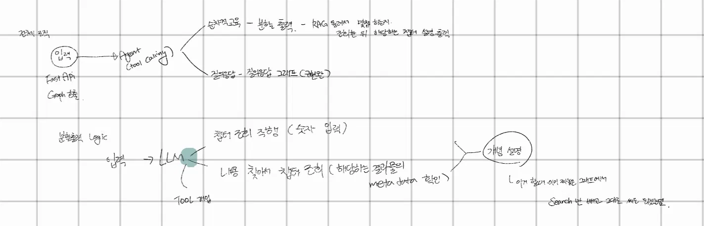

### 260720
- 오늘 목표 : 목차 생성 랭체인 -> 서브 챕터 생성 확인 / 10주차 과제 (서버 띄우고 확인) 및 회고 작성 / ICE SCORING 작성 및 왜 저번 계획을 실패했는지 작성하여 문서화 하기
  - 목차 생성 랭체인
    - 페이지가 사라지는점에서 고민 시작, text를 받아오는 방식이 페이지별임을 깨닫고 리스트의 인덱스 자체가 페이지 아닌가 하는 결론에 다달음
    - pydantic에서 페이지를 제외하기로 결정, 서브챕터용 gemini키(추후 클로드로 변경할수도) 새로 넣어주고 돌려보니 만족스러운 결과가 나왔다!!
    - 이제 이걸 데이터 청킹시 메타데이터에 어떤식으로 넣을지 혹인 documents에 어떻게 넣을지 고민을 해봐야 할것 같음 page가 사라져서 page는 쓰지 못함
    - baseline 텍스트 데이터 뽑아오는거 혹시 몰라서 남겨놓긴 했는데 안쓸듯 아쉽다 ㅜ~ㅜ
  - 10주차 과제
    - aws 가입부터 해야하네 쩝
  - ICE scoring 먼저 합시다
    - 여전히 기능 별 어떤 기술이 들어가야하는지 그래서 시간이 얼마나 걸릴지 등등을 감을 못잡겠다
    - 그럼에도 스코어링을 하며 우선순위가 바뀌었다거나 우선시 되어야 하는게 뭔지 감이 잡힌것 같음

### 260721
- 오늘 목표 : 10주차 완료, 메타데이터 부분에 챕터 삽입하기, 챕터별 분할 출력하기
  - 10주차 과제
    - 아니 허깅페이스가 메모리 용량 한참 초과하는거임!! 그래서 스왑 만들어줘서 겨우 해결했음
    - 스왑의 경우 남아도는 디스크에서 가져와서 메모리 역할을 시켜주는것 다행이게도 정상적으로 작동함!!
    - 근데 오류 터져서 보니까 코드 자체에서 안잡힌 에러였음.. 일단 코드로 복귀
  - 오류 잡기 및 메타데이터 챕터 삽입
    - 메타데이터에 넣으려고 보니 아무리 봐도 내용을 나눌 기준이 안보임..
    - 그래서 pydantic 에 start index를 넣어줌 (cleaned_docs가 페이지를 기준으로 리스트화 되어 있어서 가능)
    - 이렇게 넣다보니 챕터 인덱스도 있어야 원하는대로 계층화가 마무리 될것같아 chapter 클래스에 chapter_index를 넣고 같이 llm 에 맡김
      - 그러나 서브 챕터 인덱싱이 중복되는 경우가 많은데다 이미 start_index를 통하여 페이지를 받아오는 만큼 코드를 통해 chapter_index를 해주는게 맞는것 같음
        - 반복문으로 대충 매 페이지마다 document로 감싸면서 metadata 추가
        - last_index도 받아와서 반복문을 돌아주었는데 인덱스가 리스트의 크기를 벗어난다는 오류가 발생하였음
        - cleaned_docs(전처리된 데이터 모음)의 길이보다 길어지는 현상이 있어 enumerate로 join하여 새로운 파일 생성 & 프롬프트 수정을 해주었음
        - 그랬더니 이제는 일부 챕터를 누락하는 현상 발생 (서브챕터가 두번 들어가서 발생한 현상같음)
        - level 제한을 2로 둿었는데 그냥 풀어버림 해결!!
          - 이후 목차 생성 과정 중 인덱싱에 계속 문제가 생겼지만 프롬프트 강화로 해결보았다 굿!! (llm이 번호로 목차를 나누려고 하는게 문제였음)
      - 겸사겸사 현재 대챕터가 제목이 우선적으로 제공되어 인덱싱이 전부 0으로 되어있음 이 부분은 chapter_index를 해결할때 같이 해결하거나 서브챕터의 부모 챕터를 넣어주는 방식으로 해결해야 할것 같음
        - 필드에 parent 추가 하는 방식으로 해결했더니 제목이 제공될경우 인덱싱이 잘못 매칭되는 케이스가 해결이 됨, description 설명 보충해서 혹시 모를 케이스에 대비해주는게 좋을듯 (해결!)

### 260722
- todolist : 발표용 자료 작성, 멘토링용 질문지 작성, 10주차 회고 작성, 챕터별 분할 출력
  - 발표용 자료 작성(완), 멘토링용 질문지 작성 (데이터 관련 질문 했음, 완), 10주차 회고 작성 (완)
  - 챕터별 분할 출력
    - 미안 컨디션이 너무 안좋아서 쨌다 그냥!!

### 260723
- 챕터별 분할 출력
  - 
  - parent_num 오류 수정, 전체 실행 로직 다 잡고 수정 완료
  - 데이터 관리 부분에 대해 다시 생각해봐야 할것 같음
    - 문제점: 이미 데이터가 존재하는 상황에서 새로운 데이터가 들어오면 새 데이터를 저장해야하는데 하지 않음(파일의 존재 여부로 저장할지 불러올지 선택해서)
    - 분기 조건을 다시 생각해봐야 할것 같은데 아니면 장기 기억 관련해서 좀 생각해봐야 할것 같음
      - 우선 최우선 사항은 챕터출력노드 만들어서 질의응답 그래프랑 연결시키는것