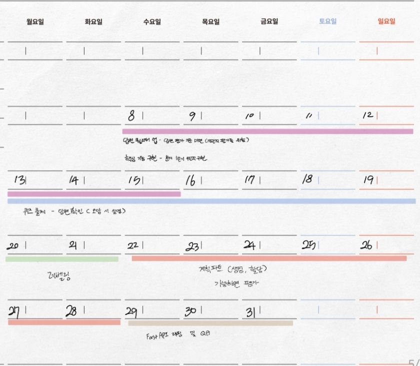

## 원래 계획 

---
## ICE SCORING 작성
[스코어링](https://docs.google.com/spreadsheets/d/1plhyzkLsk4zXTYdBmvSNE7_2aqHwLoTg76Dl5GL_Nqo/edit?usp=sharing)
- 현재는 스코어링에 기반하여 데일리 플랜 작성중 (매일 어느정도 하는지 감 잡기 용)
---
## 이전 일정 산정이 실패한 이유
- 각 기능별로 어떠한 작업이 들어가야 하는지 계획하지 않음
- 작업 과정에 걸리는 시간을 제대로 파악하지 못함
- 일정을 보면 fastapi 매핑을 따로 빼놓았는데 실제로는 테스트를 위하여 fastapi 매핑이 필수인것처럼 분리가 잘못됨
- 기능별 소요시간을 고려하지 않고 기능을 순차적으로 구현하고자 함
- 주말에 시간을 빼는 경우가 별로 없음에도 주말에는 평소보다 배로 작업 가능하리라 생각하며 일정 산정
- 일정이 제대로 지켜지는 경우는 없다며 안일한 기간 설정 및 우선순위 설정을 하였음
- 요구사항명세서 작성시 세밀함 부족으로 개발 시 필요하다며 추가되는 기능이 늘어나고 있음
---
## 재산정
- 현재 작업별 소요 시간 파악을 위하여 전체적인 일정 산정은 하지 않은 상태
- 큰 목표로 이번달 내에 필수기능 구현 완료만 잡아놓았음
- 이번주 데일리 스크럼으로 데일리 목표 산정 및 도달률 80%를 목표로 산정 연습을 할 예정
- 다음주에는 2주 플랜 작성을 하는 등 장기간 연습 예정